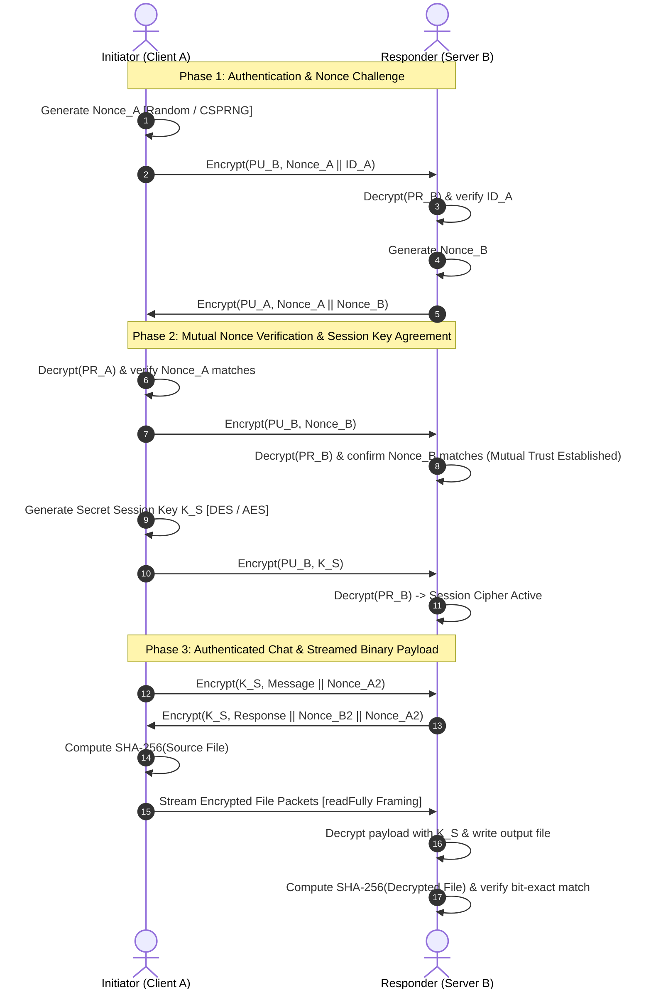

# Java Secure File Transfer & Authenticated Protocol Suite

[](https://www.oracle.com/java/)
[](https://docs.oracle.com/en/java/javase/21/security/)
[](https://csrc.nist.gov/publications/detail/fips/180/4/final)
[](https://docs.oracle.com/javase/tutorial/networking/sockets/)
[](pom.xml)
[](LICENSE)

An end-to-end cryptographic protocol and client-server socket communication suite implemented in **Java**. The protocol enforces the **CIA Triad** (Confidentiality, Integrity, and Authentication):
- **Authentication**: Needham-Schroeder mutual challenge-response handshake defending against replay attacks using cryptographic nonces.
- **Confidentiality**: Hybrid asymmetric RSA key exchange coupled with symmetric session ciphers (**DES** & **AES-128**).
- **Integrity**: End-to-end **SHA-256** checksum verification validating bit-exact transmission across TCP stream sockets.

---

## Cryptographic Protocol Sequence



---

## Key Capabilities & Senior Engineering Highlights

- **Replay Attack Immunity**: Cryptographic nonces generated for each handshake invalidate replayed or intercepted messages.
- **Robust Framing (`readFully`)**: Stream sockets use explicit frame length headers with `DataInputStream.readFully()` to prevent packet fragmentation bugs common in raw TCP communication.
- **Bit-Exact SHA-256 Integrity Verification**: Validates transmitted files against cryptographic digests to detect corrupted or tampered payloads.
- **Modern Symmetric Ciphers**: Includes standard **AES-128** (`AES/ECB/PKCS5Padding`) alongside the educational **DES** implementation.
- **Automated Verification Suite**: Standalone automated test runner (`CryptoTestSuite`) testing 18 assertions across symmetric/asymmetric ciphers, nonces, and hashing.
- **Multi-Environment Build Tooling**: Works out of the box with zero dependencies via `./scripts/build.sh`, standard Maven (`pom.xml`), or NetBeans / Apache Ant (`build.xml`).

---

## Repository Structure

```
javaSecureFileTransfer/
├── pom.xml                     # Maven configuration file (Java 17/21 target)
├── build.xml                   # Apache Ant build script
├── nbproject/                  # NetBeans IDE project metadata
├── .gitignore                  # Ignore rules for compiled .class and build artifacts
├── LICENSE                     # MIT License
├── README.md                   # Technical documentation
├── scripts/
│   ├── build.sh                # Compiles code & executes automated test suite
│   ├── run_server.sh           # Server execution launcher script
│   └── run_client.sh           # Client execution launcher script
├── src/
│   └── lab3/
│       ├── Client.java         # Initiator (Client A) client engine & transfer logic
│       ├── Server.java         # Responder (Server B) server socket engine
│       ├── KeyFunctions.java   # Cryptographic helper suite (DES, AES, RSA, SHA-256, Nonces)
│       ├── FileFunctions.java  # File I/O stream buffers & checksum utilities
│       ├── client_files/
│       │   └── input.jpg       # Sample input image transmitted by client
│       └── server_files/
│           └── output.jpg      # Output destination for decrypted image
└── test/
    └── lab3/
        └── CryptoTestSuite.java # Automated test runner (18 assertions)
```

---

## Quickstart & Execution

### Prerequisites

- **Java Development Kit (JDK 8, 17, or 21+)** (`javac` and `java` available on `$PATH`)

### 1. Build and Run Test Suite

Run the automated build script to compile all classes and execute the cryptographic test suite:

```bash
./scripts/build.sh
```

Sample output:
```
======================================================
    Compiling Java Secure File Transfer Protocol      
======================================================
✔ Compilation succeeded.

Running automated cryptographic test suite...
======================================================
     RUNNING CRYPTOGRAPHIC INTEGRITY TEST SUITE       
======================================================
  [PASS] DES: Key derived successfully
  [PASS] DES: Cipher output is non-null and not equal to plaintext
  [PASS] DES: Decrypted output matches original plaintext
  [PASS] AES: 128-bit key generated
  [PASS] AES: Cipher output generated
  [PASS] AES: Decrypted output matches original plaintext
  [PASS] RSA: KeyPair generated
  [PASS] RSA: Cipher created with public key
  [PASS] RSA: Decrypted with private key matches original
  [PASS] Nonce: Nonce within valid bound [0, 100)
  [PASS] Nonce: Matching nonces confirm positive
  [PASS] Nonce: Mismatched nonces rejected
  [PASS] Nonce: Secure random nonce generated
  [PASS] SHA-256: Digest is non-null and 64 hex characters
  [PASS] SHA-256: Digests are deterministic
  [PASS] SHA-256: Avalanche effect ensures distinct hash for modified input
  [PASS] Hex: Formatted uppercase preview matches
  [PASS] Hex: Full lowercase hex matches
------------------------------------------------------
Results: 18/18 tests passed.
✔ ALL CRYPTOGRAPHIC TESTS PASSED SUCCESSFULLY!
```

---

### 2. Start the Server

In terminal 1:
```bash
# Start server on default port 8080:
./scripts/run_server.sh

# Or specify custom port and output destination:
./scripts/run_server.sh 8080 /path/to/output.jpg
```

---

### 3. Run the Client

In terminal 2:
```bash
# Connect to localhost:8080 with default sample asset:
./scripts/run_client.sh

# Or pass custom parameters: [input_file] [host] [port]
./scripts/run_client.sh src/lab3/client_files/input.jpg localhost 8080
```

---

## Live Audit Logs

### Client Console Trace:
```
======================================================
   SECURE AUTHENTICATED SOCKET CLIENT (INITIATOR A)   
======================================================
[CONNECTING] Connecting to localhost on port 8080...
[CONNECTED] Remote socket: localhost/127.0.0.1:8080

--- [PHASE 1: AUTHENTICATION & CHALLENGE] ---
Sending Client ID & Nonce encrypted with PU_b to host:
  Client ID: INITIATOR A
  Generated Nonce A: 63
  Encrypted bytes (hex): B7 EF F5 28 80 1E 2D 27 6B 26 78 57 17 BF 42 00

--- [PHASE 2: MUTUAL CHALLENGE VERIFICATION] ---
Received cipher from host (hex): CC FF 90 C6 23 CF 0A DE
Decrypted string format: 63|2
The nonce is correct and confirmed: [63]

--- [PHASE 3: SESSION KEY AGREEMENT] ---
Sending DES secret session key (encrypted with PU_b)...
Encrypted payload size: 24 bytes

--- [PHASE 4: ENCRYPTED CHAT COMMUNICATION] ---
Extracted Host Message: I am fine thank you for asking!
The nonce is correct and confirmed: [67]

--- [PHASE 5: ENCRYPTED FILE TRANSFER] ---
Transmitting file: input.jpg (691 bytes)
Source File SHA-256: 127e6ab876ecdf34ae2c8f8c2fcf6e72766cb667ea53c98c2232425456bddbe8
Encrypted Payload Size: 696 bytes
[SUCCESS] Encrypted file transmitted successfully!
Session completed. Connection closed cleanly.
```

### Server Console Trace:
```
======================================================
   SECURE AUTHENTICATED SOCKET SERVER (RESPONDER B)   
======================================================
[LISTENING] Server active on port 8080...
[CONNECTED] Inbound connection from: /127.0.0.1:55260

--- [PHASE 1: INITIATOR CHALLENGE] ---
Extracted Nonce A: 63
Extracted Client ID: INITIATOR A

--- [PHASE 2: CHALLENGE-RESPONSE GENERATION] ---
Sending Nonce A [63] and Responder Nonce B [2] encrypted with PU_a.
The nonce is correct and confirmed: [2]

--- [PHASE 3: SESSION KEY ACQUISITION] ---
[SESSION KEY] Symmetric DES session cipher established: KALPSHAHKALPSHAH

--- [PHASE 4: ENCRYPTED CHAT COMMUNICATION] ---
Extracted Client Message: Hello how are you?

--- [PHASE 5: ENCRYPTED FILE RECEPTION] ---
Incoming encrypted payload size: 696 bytes
Payload received. Decrypting with negotiated session key...
Received file saved to: .../src/lab3/server_files/output.jpg
Decrypted File Size: 691 bytes
Decrypted File SHA-256: 127e6ab876ecdf34ae2c8f8c2fcf6e72766cb667ea53c98c2232425456bddbe8
[INTEGRITY VERIFIED] File transfer successfully validated.
Server session closed cleanly.
```

---

## License

This project is licensed under the MIT License - see the [LICENSE](LICENSE) file for details.
