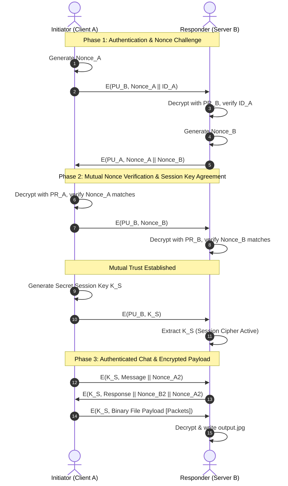

# Java Secure File Transfer & Authenticated Protocol

[](https://www.oracle.com/java/)
[](https://docs.oracle.com/en/java/javase/21/security/)
[](https://docs.oracle.com/javase/tutorial/networking/sockets/)
[](LICENSE)

An end-to-end cryptographic protocol and client-server socket communication suite implemented in **Java**. The protocol establishes mutual authentication, defends against replay attacks using cryptographic nonces, securely negotiates symmetric session keys, and performs encrypted chat message exchanges and binary file transfers (images) over raw TCP sockets.

Developed as part of **COE 817 (Network Security)** at Ryerson University.

---

## Cryptographic Protocol Sequence

The protocol implements a Needham-Schroeder style mutual challenge-response handshake prior to transmitting payload data:



---

## Key Cryptographic Capabilities

- **Replay Attack Defense**: Fresh integer nonces are generated and challenged during each communication session; expired or replayed handshakes are rejected.
- **Mutual Authentication**: Both client and server identify themselves and verify the counterparty before any payload transmission occurs.
- **Hybrid Encryption**: Combines public-key/asymmetric cryptography for initial key exchange with high-throughput symmetric block ciphers (`DES/ECB/PKCS5Padding`) for data streams.
- **Binary Stream Framing**: Encrypted image byte sequences are length-prefixed and streamed cleanly across raw TCP sockets using Java `DataInputStream` and `DataOutputStream`.
- **Cross-Platform Compatibility**: Supports native execution across Linux, macOS, and Windows with intelligent relative path resolution and CLI argument overrides.

---

## Repository Structure

```
javaSecureFileTransfer/
├── src/
│   └── lab3/
│       ├── Client.java         # Initiator (Client A) socket client & protocol engine
│       ├── Server.java         # Responder (Server B) socket server & file receiver
│       ├── KeyFunctions.java   # Cryptographic helper suite (DES/RSA ciphers, nonces, key specs)
│       ├── FileFunctions.java  # Byte buffer I/O and file stream utilities
│       ├── client_files/
│       │   └── input.jpg       # Sample input image transmitted by client
│       └── server_files/
│           └── output.jpg      # Destination directory for decrypted server output
├── build.xml                   # Apache Ant build script
├── nbproject/                  # NetBeans IDE project metadata
├── .gitignore                  # Ignore rules for compiled .class and build artifacts
├── LICENSE                     # MIT License
└── README.md                   # Technical documentation
```

---

## Building & Running

### Prerequisites

- **Java Development Kit (JDK 8 or higher)** (`javac` and `java` available on `$PATH`)

### 1. Compile the Project

Compile the Java source files into a target directory (e.g., `bin`):

```bash
mkdir -p bin
javac -d bin src/lab3/*.java
```

### 2. Start the Server

Launch the Server on a designated port (default is `8080`):

```bash
# Default port 8080, writes to src/lab3/server_files/output.jpg
java -cp bin lab3.Server

# Custom port and output path:
java -cp bin lab3.Server 8080 src/lab3/server_files/output.jpg
```

The server will listen and wait for client connections:
```
SERVER
Waiting for client on port 8080...
```

### 3. Run the Client

In a separate terminal, launch the Client:

```bash
# Connects to localhost:8080 using src/lab3/client_files/input.jpg
java -cp bin lab3.Client

# Or pass custom arguments: [input_file] [host] [port]
java -cp bin lab3.Client src/lab3/client_files/input.jpg localhost 8080
```

---

## Protocol Execution Trace

During execution, both endpoints output real-time cryptographic audit logs:

```
CLIENT
Connecting to localhost on port 8080
Connected to localhost/127.0.0.1:8080 success!

Sending client ID and nonce encrypted with B's public key PU_b to host:
Nonce Generated: 66
Client Id: INITIATOR A 
Encrypting and sending: 66|INITIATOR A

Received cipher from host:
Decrypted string format: 66|82
The nonce is correct and confirmed.

Send secret session key (DES key)
Encrypting and sending: KALPSHAHKALPSHAH

Session message: Hello how are you?|60
Received host response: I am fine thank you for asking!|25|60
The nonce is correct and confirmed.

Streaming encrypted image payload...
Connection closed successfully.
```

On the Server console:
```
SERVER
Waiting for client on port 8080...
Connected to /127.0.0.1:42656
The nonce is correct and confirmed.
The secret session key has been created.
Ready for communication....
The number of incoming packets are 696
Image successfully received and saved to: .../server_files/output.jpg
```

---

## IDE Support

This repository includes project files for **NetBeans IDE** (`nbproject/`, `build.xml`) and can also be opened directly in **IntelliJ IDEA** or **Eclipse** as a standard Java project.

---

## License

This project is licensed under the MIT License - see the [LICENSE](LICENSE) file for details.
